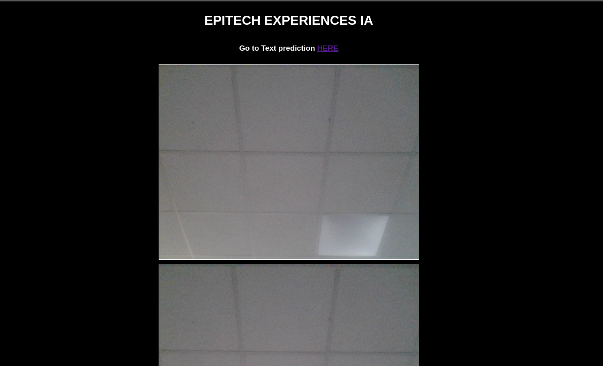

# README



Experiences Epitech Autour de l'IA basé sur COCO-SSD pour la vidéo, et sur l'entraînement d'un modèle avec TensorFlow pour l'analyse de texte.

## Prérequis

Assurez-vous d'avoir Python installé sur votre machine. Ce programme a été testé avec Python 3.7.

## Installation

1. Clonez ce dépôt sur votre machine locale.

```bash
git clone git@github.com:MartinBellot/xpiapp.git
cd xpiapp/
```

2. Créez un environnement virtuel Python.

```bash
python -m venv venv
```

3. Activez l'environnement virtuel.

```bash
source venv/bin/activate
```

4. Installez les dépendances

```bash
pip install -r requirements.txt
```

## Compilation

1. Executez le script `create_dataset.py` pour construire le Dataset -> à implementer avec + d'exemples pour + de précision.

```bash
python create_dataset.py
```

2. Exécutez le script `build.py` pour construire le modèle.

```bash
python build.py
```

3. Exécutez le script `app.py` pour créer l'application.

```bash
python app.py
```

Maintenant, votre application devrait être en cours d'exécution. Consultez la documentation de l'application pour plus d'informations sur son utilisation.